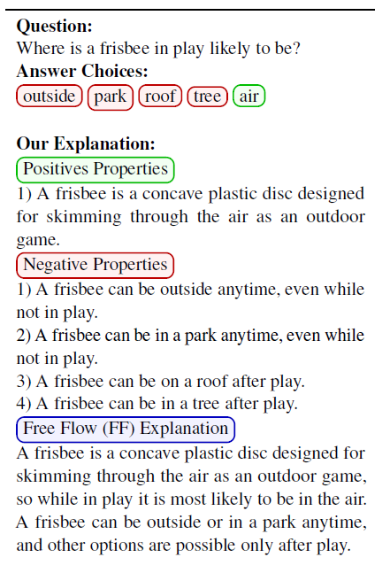

# Explanations for CommonsenseQA: Dataset

This repository contains the publicly released dataset for the Explanations for CommonsenseQA paper, presented at ACL-IJCNLP 2021. We provide the complete annotated dataset in the file ```ecqa.jsonl```, the id mappings for the train, test and validation split used in our experiments in the folder ```author_split```.

Note that these annotations are provided for the questions of the CommonsenseQA data ([https://www.tau-nlp.org/commonsenseqa](https://www.tau-nlp.org/commonsenseqa)): arXiv:1811.00937 [cs.CL] (or arXiv:1811.00937v2 [cs.CL] for this version).

We also provide a python script to glue up our data with the publicly released CQA dataset to generate the files with complete information. Please visit [https://github.com/dair-iitd/ECQA/](https://github.com/dair-iitd/ECQA/) for our code and models which uses the data for the experiments mentioned in the paper.



## Data Format

The entire annotated data is present in the file named ```ecqa.jsonl```, which contains one json object in each line. The format of the json object is as follows -

```json
{
  "id": typeof(string),
  "positives": typeoof(list_of_strings),
  "negatives": typeof(list_of_strings),
  "explanation": typeof(string)
}
```

Here, "positives" contains the list of positive properties to justify the correctness of the correct option, "negatives" contains the list of negative properties to refute the incorrect options, and "explanation" contains the free flow explanation for the question. The "id" contains the id to map the annotation to the CQA data sample.

Inside the ```author_split``` folder, we provide 3 files -
```
train_ids.txt
val_ids.txt
test_ids.txt
```

Where each file has contains ids for the corresponding train, validation and test splits, used in our experiments. Each file contains one ID per line.

## Joining with the CQA Data

First create a directory named ```cqa``` inside the root directory of the repository. Download the official train and dev split of the CommonsenseQA from their official webpage, [https://www.tau-nlp.org/commonsenseqa](https://www.tau-nlp.org/commonsenseqa), and place the following downloaded files in the above created ```cqa``` directory.
```
train_rand_split.jsonl
dev_rand_split.jsonl
```

You will need to install python ```json``` and ```pandas``` libraries to run the given script. To install them, run the following commands -

```bash
pip3 install json
pip3 install pandas
```

Now run the following command -

```bash
python3 generate_data.py
```

This command will create the following 4 files in the current directory -

```
cqa_data.csv
cqa_data_train.csv
cqa_data_val.csv
cqa_data_test.csv
```

where each of the above file, has the following 13 columns -

* {No header} : Index starting from 0
* q_no : CQA DATA ID
* q_concept : Question Concept (from CQA)
* q_text : Question Stem Text (from CQA)
* q_op1 : Option A (from CQA)
* q_op2 : Option B (from CQA)
* q_op3 : Option C (from CQA)
* q_op4 : Option D (from CQA)
* q_op5 : Option E (from CQA)
* q_ans : Answer (from CQA)
* taskA_pos : Newline separated list of positive properties (from ECQA)
* taskA_neg : Newline separeted list of negative properties (from ECQA)
* taskB : Free flow explanation for the CQA sample (from ECQA)

The first file has the complete data, while the other 3 contain the train, validation and test data used in the experiments desribed in our paper.

## Citations
Please consider citing this paper if you use the data:
```
@inproceedings{aggarwaletal2021ecqa,
  title={{E}xplanations for {C}ommonsense{QA}: {N}ew {D}ataset and {M}odels},
  author={Shourya Aggarwal and Divyanshu Mandowara and Vishwajeet Agrawal and Dinesh Khandelwal and Parag Singla and Dinesh Garg},
  booktitle="Proceedings of the 59th Annual Meeting of the Association for Computational Linguistics and the 11th International Joint Conference on Natural Language Processing (Volume 1: Long Papers)}",
  year = "2021",
  address = "Online",
  publisher = "Association for Computational Linguistics"
}
```

## License
[Community Data License Agreements Sharing license 1.0](https://github.com/Community-Data-License-Agreements/Releases)
